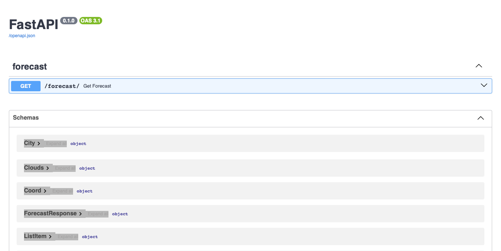
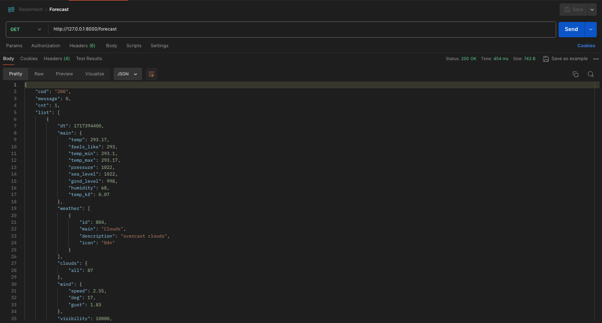
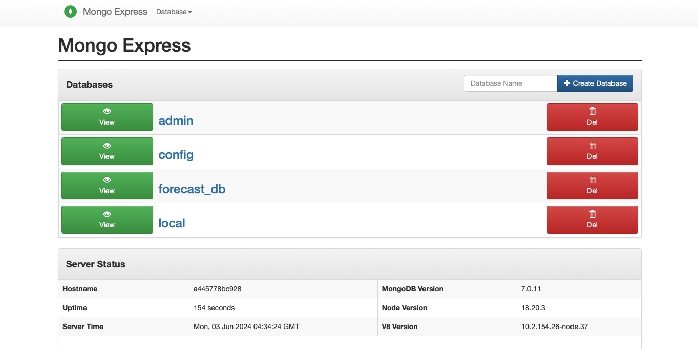
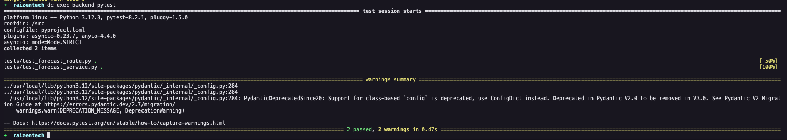

<!-- Title -->

<h1 align="center">
   Avaliação técnica Backend Python
</h1>

<!-- Description -->

<h3 align="center">
   Desenvolvimento de API para previsão do tempo
</h3>

<p align="center">
   
</p>

<br>

## Sobre o projeto

Elaborar uma aplicação de _backend_ que deverá conter uma API retornando os dados da previsão do tempo dos próximos dias utilizando a API do https://openweathermap.org/. Salvar o histórico de consultas em um banco de dados não relacional, para consulta posterior.

## Funcionalidades

- [x] Endpoint para consulta da previsão do tempo

## Clonando a aplicação

```bash
# Faça o clone do repositório
$ git clone https://github.com/IgorFreitasCruz/raizentech.git .

# Acesso o diretório do projeot
$ cd raizentech
```

### Executando a aplicação via Docker

```bash
# Execute o container da aplicação
$ docker-compose up -d
```

## Documentação

Para ter acesso à aplicação acesse ```http://localhost:8000/docs```. Para testar a API via Swagger clique em `GET`, depois vá em `Try it out` e selecione `Execute`.

<p align="center">
   
</p>

Caso preferir, você também pode fazer o teste via Postman.

<p align="center">
   
</p>

## Histórico de consultas

Para visualizar o histórico de consultas acesse ```http://localhost:8081```, clique em `forecast_db` e depois em `View`:

<p align="center">
   
</p>

## Executando testes da aplicação

Para realizar os testes da aplicação certifique-se de estar com os containers ativos, e, em seguida, execute o comando abaixo.
```bash
$ docker-compose exec backend pytest
```

<p align="center">
   
</p>

## Tecnologias utilizadas no projeto

-   FastAPI
-   Docker
-   Mongo
-   Mongo Express

## Autor
<a>
 
 <sub><b>Igor de Freitas Cruz</b></sub></a> 🚀
 <br />

[](https://www.linkedin.com/in/igorfreitascruz/)
[](mailto:igor.freitas.cruz@icloud.com)

Made with ❤️ by Igor Cruz 👋🏻 [Contact me!](https://www.linkedin.com/in/igorfreitascruz/)